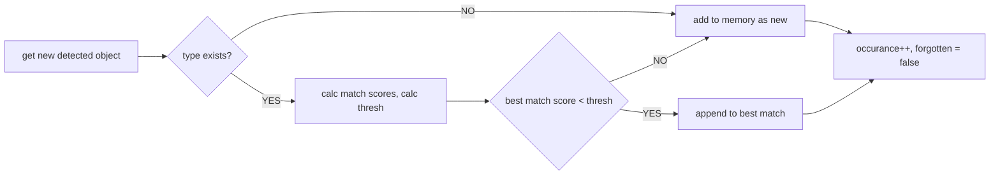
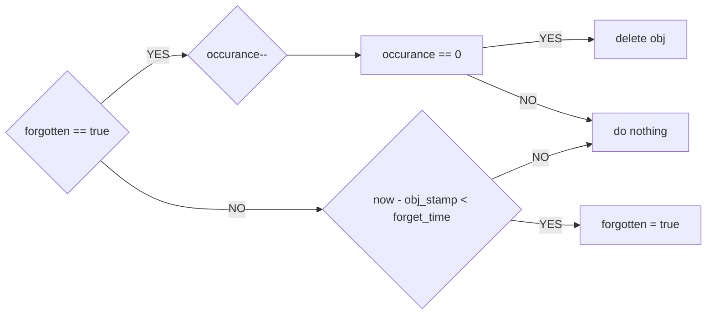

__THIS REPOSITORY IS ON EARLY STAGE OF DEVELOPMENT__

#  object_spatial_tools_ros
Nodes to work with results of [Extended Object Detection node](https://github.com/Extended-Object-Detection-ROS/extended_object_detection).

## 1. robot_short_object_memory_node.py
Remembers objects in moving frame for short period of time.  
Simplified algorithm to add new object.

Formula for match score   
Simplified algorithm to update objects

### Params
 - __~target_frame__ (string, default: odom) frame for remembered objects
 - __~score_multiplyer__ (double, default: 2) multiplier for score, to check similarity of objects
 - __~update_rate_hz__ (double, default: 5 [hz]) rate of update algorithm (see below)
 - __~forget_time__ (double, default: 10 [sec]) time to remove object if not seen
 - __~update_count_thresh__ (double, default: 0) limit for previous position used for update, if 0 - no limit

### Subscribed topics
- __simple_objects__ (extended_object_detection/SimpleObjectArray) input result of detection
- __complex_objects__ (extended_object_detection/ComplexObjectArray) input result of detection
- 
### Published topics
- __~memory_map__ (visualization_msgs/MarkerArray) visualization of results
- TODO: results itself!

## 2. robot_kf_undirected_object_tracker_node.py
Tracks visually detected objects in 3d space. Works with unoriented objects. Kalman Filter estimates x,y, vx, vy parameters.

### Params
 - __~target_frame__ (string, default: odom) frame for tracking
 - __~tf_pub_prefix__ (string, default: "") is set, prefix will be added to broadcasted tf frames
 - __~tracked_objects_type_names__ (list, default: []) object names from object base to track
 - __~Qdiag__ (list, default: [0.1, 0.1, 0.1, 0.1]) diagonal values of Q matrix
 - __~Rdiag__ (list, default: [0.1, 0.1]) diagonale values of R matrix
 - __~k_decay__ (double, default: 1) track speed reducer, new step speed will be `k * speed_prev`
 - __~lifetime__ (double, default: 0) how long to perform tracking when objects disappears, if 0 - infinite
 - __~mahalanobis_max__ (double, default: 1) Mahalanobis dist when new object might be added to existing track
 - __~update_rate_hz__ (double, default: 5 [hz]) rate of tracker
 
### Subscribed topics
- __simple_objects__ (extended_object_detection/SimpleObjectArray) input result of detection
- __complex_objects__ (extended_object_detection/ComplexObjectArray) input result of detection

### Published topics
- __~vis__ (visualization_msgs/MarkerArray) visualization of results
- TODO: results itself!
